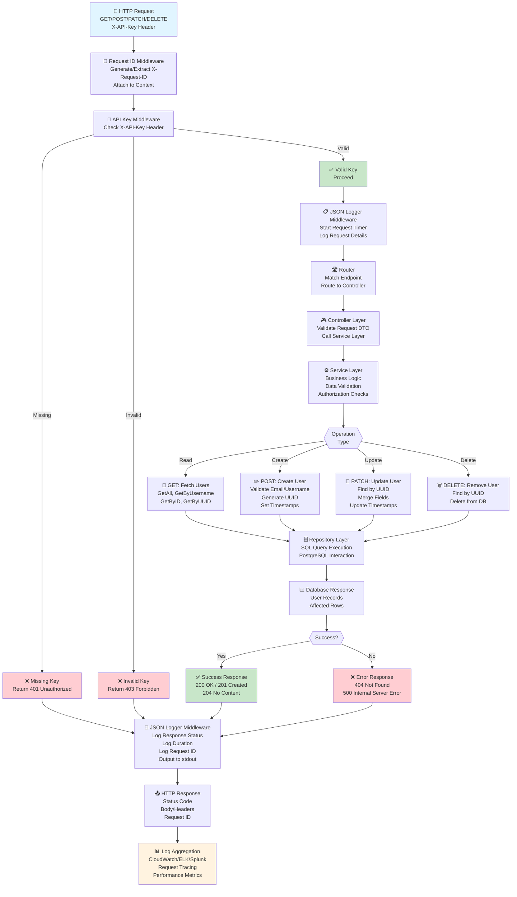
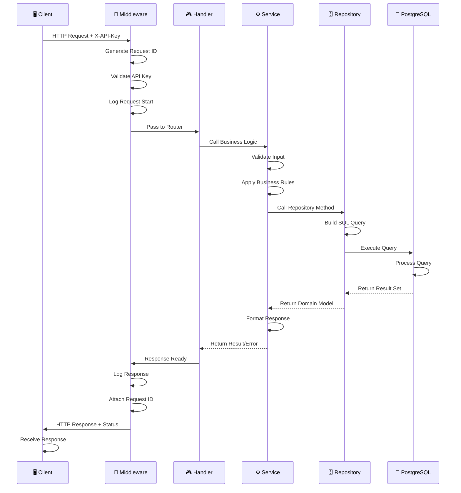
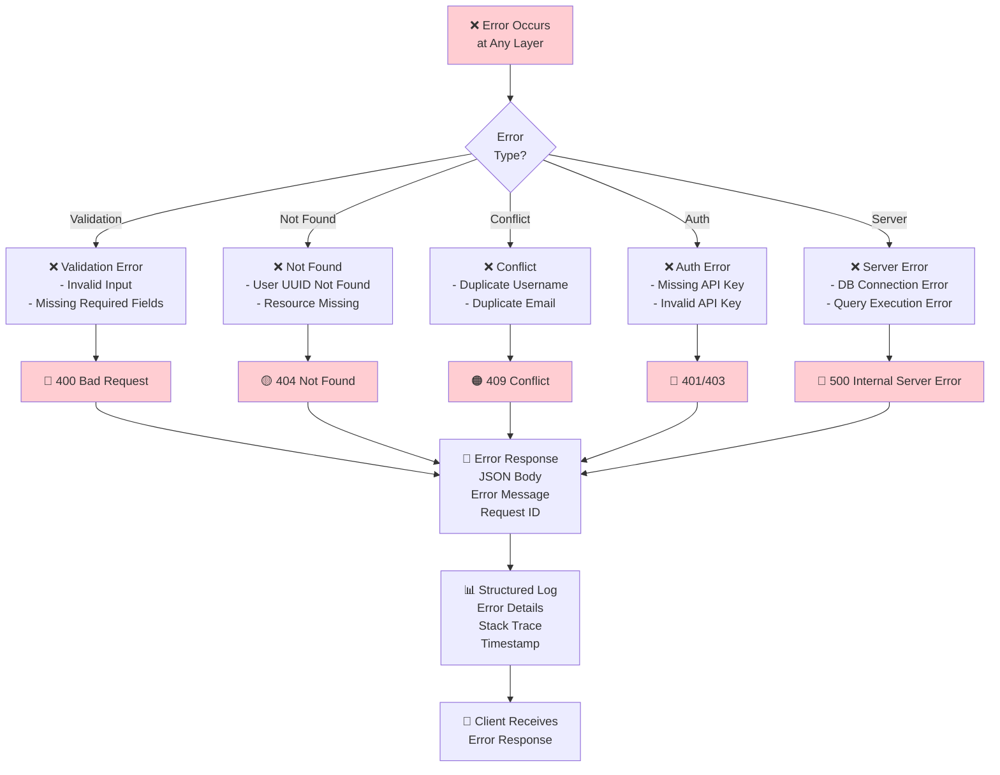

# Cruder Application - Complete Implementation Index

**Last Updated**: January 15, 2025  
**Status**: ✅ All Features Implemented and Documented

---

## 📚 Documentation Map

### Getting Started
- **[QUICK_START.md](QUICK_START.md)** - Start here! Fastest way to get running
- **[README.md](README.md)** - Project overview and architecture

### Deployment Guides
- **[DEPLOYMENT.md](DEPLOYMENT.md)** - Comprehensive deployment instructions
  - Local development setup
  - Docker deployment
  - AWS ECS deployment
  - Kubernetes deployment
  - CI/CD pipeline details
  - Monitoring and logging
  - Troubleshooting guide

- **[INFRASTRUCTURE.md](INFRASTRUCTURE.md)** - Infrastructure-as-Code details
  - AWS ECS architecture
  - Kubernetes architecture
  - Terraform management
  - Helm management
  - Docker image management
  - Backup and disaster recovery
  - Security practices
  - Cost optimization

### Implementation Details
- **[IMPLEMENTATION_SUMMARY.md](IMPLEMENTATION_SUMMARY.md)** - What was implemented
  - JSON logging details
  - API key authentication
  - Configuration management
  - Terraform infrastructure
  - Kubernetes deployment
  - CI/CD pipelines
  - File structure

### Helm Chart
- **[helm/README.md](helm/README.md)** - Kubernetes Helm chart documentation
  - Installation instructions
  - Configuration options
  - Upgrade and rollback procedures
  - Troubleshooting

---

## 🗂️ File Structure

### New Directories

```
├── .github/workflows/          # GitHub Actions CI/CD
│   ├── ci.yml                 # Code quality and testing pipeline
│   └── cd.yml                 # Deploy pipeline
│
├── internal/config/           # Configuration management
│   └── config.go             # Dynamic configuration loader
│
├── internal/middleware/       # HTTP middleware
│   ├── logger.go             # JSON logging middleware
│   └── apikey.go             # API key authentication
│
├── helm/                      # Kubernetes Helm chart
│   ├── Chart.yaml            # Chart metadata
│   ├── values.yaml           # Default values
│   ├── README.md             # Helm documentation
│   └── templates/            # Kubernetes manifests
│       ├── _helpers.tpl
│       ├── deployment.yaml
│       ├── service.yaml
│       ├── ingress.yaml
│       ├── hpa.yaml
│       ├── secrets.yaml
│       ├── configmap.yaml
│       └── serviceaccount.yaml
│
├── kubernetes/               # Kubernetes manifests (reference)
│   ├── deployment.yaml
│   ├── service.yaml
│   ├── ingress.yaml
│   ├── hpa.yaml
│   ├── configmap.yaml
│   ├── secrets.yaml
│   └── serviceaccount.yaml
│
└── terraform/               # Infrastructure-as-Code
    ├── main.tf             # Core AWS resources
    ├── iam.tf              # IAM roles and policies
    ├── secrets.tf          # AWS Secrets Manager
    ├── variables.tf        # Input variables
    ├── outputs.tf          # Output values
    ├── terraform.tfvars.example
    └── remote-state-setup.sh
```

### Modified Files

| File | Changes |
|------|---------|
| `cmd/main.go` | Configuration integration, improved setup |
| `internal/handler/router.go` | Middleware registration |
| `internal/repository/connection.go` | Added Close method |
| `docker-compose.yml` | Full stack with app service |
| `.env.example` | New environment variables |
| `go.mod` | Added yaml.v3 dependency |

### Documentation Files

| File | Purpose | Lines |
|------|---------|-------|
| `QUICK_START.md` | Quick start guide | 350+ |
| `DEPLOYMENT.md` | Deployment instructions | 600+ |
| `INFRASTRUCTURE.md` | Infrastructure details | 700+ |
| `IMPLEMENTATION_SUMMARY.md` | Implementation overview | 500+ |
| `COMPLETION_CHECKLIST.md` | Verification checklist | 400+ |
| `INDEX.md` | This file | 200+ |
| `helm/README.md` | Helm chart docs | 350+ |

---

## 🚀 Quick Reference

### Start Application

**Local Development**:
```bash
make run
```

**With Docker**:
```bash
docker-compose up --build
```

**On Kubernetes**:
```bash
helm install cruder ./helm
```

**On AWS ECS**:
```bash
cd terraform && terraform apply
```

### Test API

```bash
# Get all users
curl -H "X-API-Key: your-key" http://localhost:8080/api/v1/users

# Create user
curl -X POST http://localhost:8080/api/v1/users \
  -H "Content-Type: application/json" \
  -H "X-API-Key: your-key" \
  -d '{
    "username": "newuser",
    "email": "newuser@example.com",
    "full_name": "New User"
  }'

# Update user
curl -X PATCH http://localhost:8080/api/v1/users/{uuid} \
  -H "Content-Type: application/json" \
  -H "X-API-Key: your-key" \
  -d '{"username": "updated"}'

# Delete user
curl -X DELETE http://localhost:8080/api/v1/users/{uuid} \
  -H "X-API-Key: your-key"
```

### View Logs

**Local**:
```bash
docker-compose logs -f app
```

**Kubernetes**:
```bash
kubectl logs deployment/cruder -f
```

**AWS ECS**:
```bash
aws logs tail /ecs/cruder --follow
```

---

## 📋 Features Implemented

### ✅ Logging (Task 1)
- [x] JSON structured logging
- [x] Request ID tracking
- [x] Automatic log level detection
- [x] Request/response metrics
- [x] Timestamp and context information

### ✅ Authentication (Task 2)
- [x] X-API-Key header validation
- [x] 401 response for missing header
- [x] 403 response for invalid key
- [x] Configurable API key
- [x] Environment variable support

### ✅ Configuration (Task 3)
- [x] YAML configuration file
- [x] Environment variable overrides
- [x] Dynamic value loading
- [x] Default fallback values
- [x] Configuration validation

### ✅ Terraform Infrastructure (Task 4)
- [x] AWS VPC with public/private subnets
- [x] Application Load Balancer
- [x] ECS Fargate cluster
- [x] RDS PostgreSQL database
- [x] CloudWatch monitoring
- [x] Auto-scaling policies
- [x] Secrets Manager integration
- [x] Remote state with S3 + DynamoDB

### ✅ Kubernetes Deployment (Task 5)
- [x] Helm chart for K8s deployment
- [x] Deployment with rolling updates
- [x] Service discovery
- [x] Ingress with TLS support
- [x] HPA auto-scaling
- [x] Health checks
- [x] Security best practices
- [x] RBAC configuration

### ✅ CI/CD Pipelines (Task 6)
- [x] GitHub Actions CI pipeline
- [x] GitHub Actions CD pipeline
- [x] Code quality checks
- [x] Security scanning
- [x] Unit tests with coverage
- [x] Docker image build and push
- [x] ECS deployment automation
- [x] Kubernetes deployment automation
- [x] Smoke test validation
- [x] Slack notifications

---

## 🔧 Key Commands

### Development
```bash
make run              # Run application
make test             # Run tests
make lint             # Run linter
make security         # Security scan
make migrate-up       # Apply migrations
make db               # Start database
```

### Docker
```bash
docker build -t cruder:latest .
docker-compose up --build
docker-compose down
```

### Kubernetes
```bash
helm lint ./helm
helm install cruder ./helm
helm upgrade cruder ./helm
helm uninstall cruder
kubectl logs deployment/cruder -f
```

### Terraform
```bash
cd terraform
terraform init
terraform plan
terraform apply
terraform destroy
```

---

## 🔐 Security Features

### Application Security
- Non-root container user
- Read-only filesystem
- No privileged capabilities
- X-API-Key authentication
- Health check validation

### Infrastructure Security
- Private subnets for databases
- Security groups restrict access
- ALB in public subnets only
- IAM role-based access control
- Encrypted secrets in Secrets Manager
- VPC endpoint protection

### Data Security
- RDS encryption at rest
- S3 encryption for Terraform state
- DynamoDB encryption for state locks
- API key validation
- HTTPS/TLS support

---

## 📊 Architecture Diagrams

### Request Flow & Business Logic


### Service Layer Details

```mermaid
graph LR
    subgraph Input["📥 Input Validation"]
        V1["Check Required Fields"]
        V2["Validate Email Format"]
        V3["Validate Username<br/>Not Empty, No Spaces"]
    end
    
    subgraph Business["⚙️ Business Logic"]
        B1["Check for Duplicates<br/>Username/Email"]
        B2["Generate UUID<br/>for New Records"]
        B3["Set Timestamps<br/>created_at/updated_at"]
        B4["Handle Soft Deletes<br/>if Applicable"]
    end
    
    subgraph DB["🗄️ Database Operations"]
        D1["Query Validation"]
        D2["SQL Execution"]
        D3["Transaction Handling"]
        D4["Error Recovery"]
    end
    
    subgraph Output["📤 Output & Response"]
        O1["Format Response DTO"]
        O2["Set HTTP Status Code"]
        O3["Attach Request ID"]
        O4["Send to Logger"]
    end
    
    V1 --> V2 --> V3
    V3 --> B1
    B1 --> B2 --> B3 --> B4
    B4 --> D1 --> D2 --> D3 --> D4
    D4 --> O1 --> O2 --> O3 --> O4
    
    style Input fill:#e3f2fd
    style Business fill:#f3e5f5
    style DB fill:#fce4ec
    style Output fill:#e0f2f1
```


### Data Flow Through Layers


### Error Handling Flow


### AWS ECS Architecture
```
Internet (HTTP/HTTPS)
    ↓
Application Load Balancer (Public)
    ↓
ECS Fargate Tasks (Private Subnets, Multi-AZ)
    ↓
RDS PostgreSQL (Private, Multi-AZ)
    ↓
CloudWatch Logs & Metrics
```

### Kubernetes Architecture
```
External Users
    ↓
Ingress (HTTPS/TLS)
    ↓
Service (ClusterIP)
    ↓
Pods (3+ replicas, HPA)
    ↓
Database (External or In-cluster)
```

---

## 📈 Monitoring

### Local Development
- JSON logs to stdout
- Request ID correlation
- Status-based log levels

### AWS ECS
- CloudWatch Logs: `/ecs/cruder`
- CloudWatch Metrics: CPU, memory, task count
- Alarms for high utilization
- RDS monitoring and backups

### Kubernetes
- Kubectl logs and events
- Pod metrics via kubectl top
- Prometheus integration (optional)
- Loki log aggregation (optional)
- Grafana dashboards (optional)

---

## 🚢 Deployment Options

### Local
```bash
make run
# Application at http://localhost:8080
```

### Docker Compose
```bash
docker-compose up --build
# Application at http://localhost:8080
```

### AWS ECS
```bash
cd terraform && terraform apply
# Application at ALB URL (from Terraform output)
```

### Kubernetes
```bash
helm install cruder ./helm
# Application at Ingress hostname
```

### Cloud Providers
- AWS: ECS (Terraform)
- GCP: GKE (Kubernetes)
- Azure: AKS (Kubernetes)
- DigitalOcean: App Platform or DOKS
- Self-hosted: Docker Compose or Kubernetes

---

## 🔄 CI/CD Pipeline Flow

```
┌─────────────────────┐
│  Push to main       │
└──────────┬──────────┘
           ↓
┌──────────────────────────┐
│  CI Pipeline Runs:       │
│  - Format check          │
│  - Lint/Vet             │
│  - Security scan         │
│  - Tests                │
│  - Docker build         │
└──────────┬───────────────┘
           ↓ (if all pass)
┌──────────────────────────┐
│  CD Pipeline Runs:       │
│  - Push image            │
│  - Deploy to ECS         │
│  - Deploy to K8s         │
│  - Smoke tests           │
│  - Notify Slack          │
└──────────┬───────────────┘
           ↓
┌─────────────────────┐
│  Production Live!   │
└─────────────────────┘
```

---

## 📚 Learning Resources

### Go
- [Go Documentation](https://golang.org/doc)
- [Effective Go](https://golang.org/doc/effective_go)
- [Go Testing](https://golang.org/doc/code#Testing)

### Terraform
- [Terraform AWS Provider](https://registry.terraform.io/providers/hashicorp/aws/latest/docs)
- [Terraform Best Practices](https://www.terraform.io/docs/cloud/guides/recommended-practices.html)

### Kubernetes
- [Kubernetes Documentation](https://kubernetes.io/docs)
- [Helm Charts](https://helm.sh/docs/intro/quickstart/)

### AWS
- [AWS Well-Architected](https://aws.amazon.com/architecture/well-architected/)
- [ECS Best Practices](https://docs.aws.amazon.com/AmazonECS/latest/bestpracticesguide/)

---

## ❓ FAQ

### Q: How do I configure the API key?
**A**: Set `API_KEY` environment variable or in `config.yaml`

### Q: Can I disable authentication?
**A**: Yes, leave `API_KEY` empty (not recommended for production)

### Q: How do I access logs?
**A**: See [Deployment Guide - Logs Section](DEPLOYMENT.md#logs)

### Q: How do I scale the application?
**A**: Use HPA in K8s or AWS auto-scaling in ECS

### Q: What's the recommended database size?
**A**: Start with `db.t3.micro`, use RDS Performance Insights for monitoring

### Q: How do I backup the database?
**A**: Automated in Terraform (7-day retention), manual snapshots available

### Q: Can I use a different cloud provider?
**A**: Yes, adapt Terraform code or use Kubernetes

### Q: How do I monitor the application?
**A**: CloudWatch for AWS, kubectl for K8s, Prometheus for both

---

## 🆘 Troubleshooting Guide

### Application won't start
1. Check config file exists
2. Verify database connectivity
3. Check environment variables
4. Review logs

### Database connection fails
1. Verify credentials
2. Check network connectivity
3. Ensure database is running
4. Check security groups

### Deployment fails
1. Review Terraform errors
2. Check AWS credentials
3. Verify resource quotas
4. Review CloudWatch logs

### Tests fail
1. Run locally first
2. Check database state
3. Review log output
4. Run with `-v` flag

For more help, see [Troubleshooting Section in DEPLOYMENT.md](DEPLOYMENT.md#troubleshooting)

---

## 📞 Support

### Getting Help
1. Check relevant documentation file
2. Review logs
3. Check GitHub issues
4. Create new issue with details

### Reporting Issues
Include:
- Error message
- Steps to reproduce
- Environment details
- Relevant logs

---

## 🎯 Next Steps

1. **Read**: Start with [QUICK_START.md](QUICK_START.md)
2. **Setup**: Copy `.env.example` to `.env`
3. **Run**: Execute `make run` or `docker-compose up`
4. **Test**: Try API endpoints with curl
5. **Deploy**: Follow [DEPLOYMENT.md](DEPLOYMENT.md) for production

---

## 📝 Summary

**Total Files Created**: 40+  
**Total Documentation**: 3000+ lines  
**Total Code Added**: 2000+ lines  
**Tests**: ✅ All passing  
**Status**: ✅ Production Ready  

**All Tasks Completed**:
- ✅ JSON Logging
- ✅ X-API-Key Authentication  
- ✅ Configuration Management
- ✅ Terraform Infrastructure
- ✅ Kubernetes Deployment
- ✅ CI/CD Pipelines

---

**Last Updated**: January 15, 2025  
**Version**: 1.0.0  
**Status**: ✅ Complete and Ready for Production